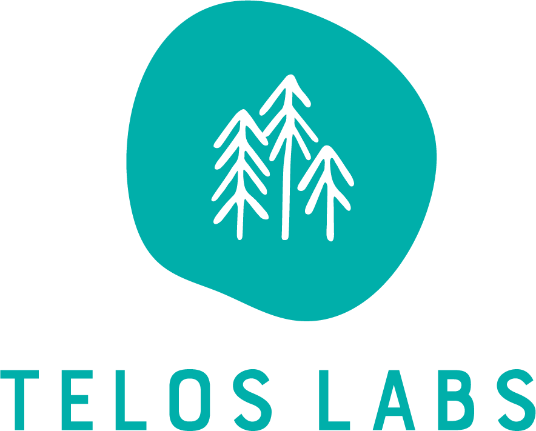

Setup
======

Script to set up a macOS laptop for web development.

It can be run multiple times on the same machine safely.
It installs, upgrades, or skips packages
based on what is already installed on the machine.

Requirements
------------

We support:

* macOS Sonoma (14.x) on Apple Silicon and Intel
* macOS Ventura (13.x) on Apple Silicon and Intel
* macOS Monterey (12.x) on Apple Silicon and Intel

Older versions may work but aren't regularly tested.
Bug reports for older versions are welcome.

Install
-------

Download the script:

```sh
curl --remote-name https://raw.githubusercontent.com/TelosLabs/laptop-setup/main/setup_mac
```

Execute the downloaded script:

```sh
sh setup_mac
```

What it sets up
---------------

macOS tools:

* [Homebrew] for managing operating system libraries.

[Homebrew]: http://brew.sh/

Unix tools:

* [Universal Ctags] for indexing files for vim tab completion
* [Git] for version control
* [OpenSSL] for Transport Layer Security (TLS)
* [Tmux] for saving project state and switching between projects
* [Zsh] as your shell

[Git]: https://git-scm.com/
[OpenSSL]: https://www.openssl.org/
[Tmux]: http://tmux.github.io/
[Zsh]: http://www.zsh.org/

Heroku tools:

* [Heroku CLI] and [Parity] for interacting with the Heroku API

[Heroku CLI]: https://devcenter.heroku.com/articles/heroku-cli
[Parity]: https://github.com/thoughtbot/parity

GitHub tools:

* [GitHub CLI] for interacting with the GitHub API

[GitHub CLI]: https://cli.github.com/

Image tools:

* [ImageMagick] for cropping and resizing images

Programming languages, package managers, and configuration:

* [asdf-vm] for managing programming language versions
* [Bundler] for managing Ruby libraries
* [Node.js] and [npm], for running apps and installing JavaScript packages
* [Ruby] stable for writing general-purpose code
* [Yarn] for managing JavaScript packages
* [Rosetta 2] for running tools that are not supported in Apple silicon processors

GUI tools
* [Slack] for team communication
* [Krisp] for noise cancellation in calls
* [Tuple] for pair programming
* [Visual Studio Code] for writing code

[Bundler]: http://bundler.io/
[ImageMagick]: http://www.imagemagick.org/
[Node.js]: http://nodejs.org/
[npm]: https://www.npmjs.org/
[asdf-vm]: https://github.com/asdf-vm/asdf
[Ruby]: https://www.ruby-lang.org/en/
[Yarn]: https://yarnpkg.com/en/
[Rosetta 2]: https://developer.apple.com/documentation/apple-silicon/about-the-rosetta-translation-environment
[Slack]: https://slack.com/
[Krisp]: https://krisp.ai/
[Tuple]: https://tuple.app/
[Visual Studio Code]: https://code.visualstudio.com/

Databases:

* [Postgres] for storing relational data
* [Redis] for storing key-value data

[Postgres]: http://www.postgresql.org/
[Redis]: http://redis.io/

Gems

* [Rails] our main web framework

[Rails]: http://rubyonrails.org/

----------------


